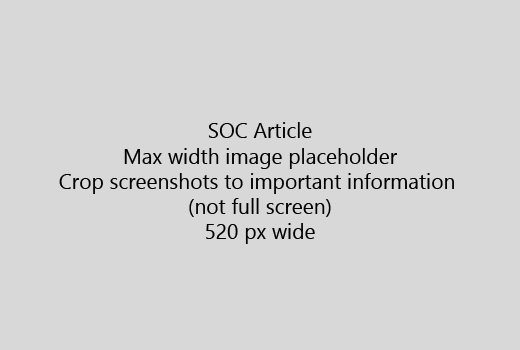

Artikkelin alussa erittäin lyhyt esittely (1 virke). Asettaa itse lukijan - eivät ne tähän? Mitä niiden pitäisi tehdä?Start your article with a very short introduction (1 sentence). Put yourself in the reader's place - why are they here? What should they do? 
  
1. Saat suoran suorittamaan tehtävän vaiheiden luettelo.Get straight to a quick list of steps to accomplish the task.
    
    Jos sinun täytyy selittää käsite tai hänen on tehtävä valmiiksi kaikki tarvittavat toimet, Lisää vaihe, jossa he tarvitsevat ja käsite tai vaiheet [linkkiä](https://support.office.com/article/f37e7984-cf03-4fde-92d3-82970d7e241b.aspx) alla nopean yhteenvedon.If you need to explain a concept, or they have to do pre-requisite steps, add a quick summary below the step where they need it, and [link](https://support.office.com/article/f37e7984-cf03-4fde-92d3-82970d7e241b.aspx) to the concept or steps. 
    
2. Pidä lyhyt - menettelyjen mieluiten 5 tai vähemmän vaiheita, enintään 8.Keep procedures short - preferably 5 or fewer steps, no more than 8.
    
3. Käyttää **käyttöliittymätyyliä** käyttöliittymän osat tai tekstin käyttäjien täytyy syöttää.Use **Ui style** for user interface elements or for text people need to enter. 
    
4. Käytä verbeistä valita, tai syötä toiminnot ja valitse Muotoile valikot **valikko** \> **komento**.Use the verbs choose, select, or enter as actions, and format menus as **Menu** \> **Command**.
    
5. Voit lisätä kuva konteksti (Jos Käyttöliittymä on vaikea paikantaa tai sen tehtävän suorittamiseen tarvittavaa).Optionally, add a screenshot for context (if UI is hard to locate, or it's needed to complete the task).
    
    Suurin leveys: 520 kuvapistettä. Standard teema, ei näytä mitään henkilökohtaisia tietoja ja rajata näyttämään vain mitä on merkitystä.Maximum width: 520 pixels. Use a standard theme, do not show any personal information, and crop to show only what's relevant. 
    
    
  
Jos haluat lisätä video tai kuva, kahden sarakkeen ruudukon välit ja ohjeita vasemmalla ja video tai kuva oikeassa - on [Esimerkki video ruudukon ja ohjeita](https://support.office.com/article/14ce8e82-efa0-47f5-bb84-94f078db3dae.aspx).If you want to add a video or screenshot, use a two-column grid and have the steps in the left and the video or screenshot in the right - see [Steps and video grid example](https://support.office.com/article/14ce8e82-efa0-47f5-bb84-94f078db3dae.aspx). 
  
Enintään 500 sanaa artikkeli kohde.Target no more than 500 words for an article.
  
# Esimerkki artiklanExample article

[Muuta oma kuvaChange my photo](https://support.office.com/article/555376e0-1fca-49ba-8434-307a0525c767.aspx)
  

