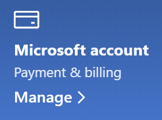

# Microsoft-tilin tietojen muuttaminen

Siirry osoitteeseen [https://account.microsoft.com](https://account.microsoft.com/) ja kirjaudu sisään tarvittaessa. Tämä vie sinut tilin koontinäyttöön.  

**Oman nimen ja henkilökohtaisten tietojen muokkaaminen**

1. Napsauta tilin koontinäytössä tilin kuvan ja nimen vieressä olevaa kolmea kohtaa (lisää toimintoja) > Muokkaa profiilia**.
2. **Muokkaa profiilia** -sivulla olevien linkkien avulla voit muuttaa profiilikuvaasi, nimeä, syntymäpäivääsi, sijaintiasi ja näyttökieltäsi. Huomaa Xbox- tai Skype-tiliprofiilien linkit, joissa voit muuttaa näitä tilejä koskevia tietoja.

**Sähköpostiosoitteiden ja puhelinnumeroiden hallinta**

Microsoft-tiliin on liitetty yksi tai useampi sähköpostiosoite tai puhelinnumero aliaksina. Voit hallita näitä seuraavasti:

1. Napsauta tilin koontinäytössä tilin kuvan ja nimen vieressä olevaa kolmea kohtaa (lisää toimintoja) > **Muokkaa profiilia**.
2. Valitse **Muokkaa profiilia** -sivulla **Hallitse, miten kirjaudut sisään Microsoftiin**. 
3. Näet luettelon tilin aliaksista ja voit hallita luetteloa, kuten lisätä ja poistaa sähköpostiosoitteita ja puhelinnumeroita. Tässä voit myös valita, millä aliaksilla tiliin voi kirjautua ja mitä aliasta pidetään ensisijaisena, mikä näkyy Windows 10 -laitteissasi.

**Maksutapojen sekä laskutuksen nimen ja osoitteen hallinta** 

1. Napsauta tilin koontinäytössä tilin kuvan ja nimen vieressä olevaa kolmea kohtaa (lisää toimintoja) > **Muokkaa profiilia**.
2. Valitse kohdan **Maksaminen ja laskutus** alla **Hallinta**.

    

3. Tässä voit lisätä, muokata ja poistaa maksutapoja ja niihin liittyviä laskutusosoitteita. 
