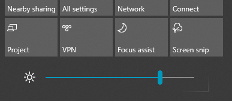

# Näytön kirkkauden muuttaminen Windows 10:ssä

Jos Windows 10 on versiota 1903 uudempi, sen toimintokeskuksesta löytyy **Kirkkauden liukusäädin**. Avaa toimintokeskus napsauttamalla **Ilmoitus**-painiketta tehtäväpalkin oikeanpuoleisimmasta reunasta tai painamalla näppäinyhdistelmää **Windows home + A**.

Jos käytössäsi Windows 10:n aiempi versio, kirkkauden liukusäädin löytyy kohdasta **[Asetukset > Järjestelmä > Näyttö](ms-settings:display?activationSource=GetHelp)**.

**Huomautukset**:

- Muuta kirkkautta -valinta ei ehkä näy näytön liukusäätimessä pöytätietokoneissa, joissa on ulkoinen näyttö. Voit muuttaa ulkoisen näytön kirkkautta näytön ohjausobjektien avulla.
- Jos sinulla ei ole pöytätietokonetta ja liukusäädin ei näy tai toimi, yritä päivittää näytönohjain. Kirjoita tehtäväpalkin hakuruutuun **Laitehallinta** ja valitse sitten tuloksista **Laitehallinta**. Valitse **Laitehallinta**-ruudussa **Näyttösovittimet** ja valitse sitten näyttösovitin. Paina pitkään näyttösovittimen nimeä (tai napsauta hiiren kakkospainikkeella) ja napsauta **Päivitä ohjain**, ja seuraa sitten ohjeita.
