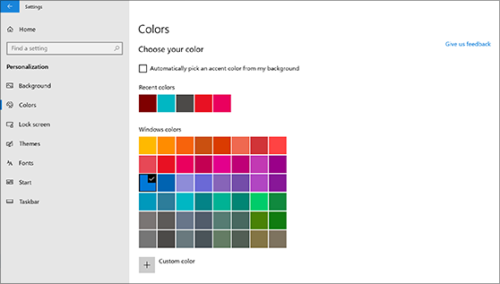
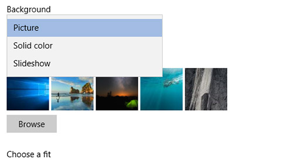

# Työpöydän taustan ja värien muuttaminen

Jos haluat vaihtaa värit-asetusta, valitse **Aloitus**  >  **Asetukset**-kohdan  >  **mukauttaminen**  >  **värit**ja sitten oma värisi tai anna Windowsin vetää korostus väri taustasta.

Jos haluat muuttaa työpöydän taustaa, siirry **Aloitus**  >  **asetusten**  >  **mukauttaminen**-  >  **tausta**kuvaan, valitse kuva, yksivärinen tai Luo diaesitys kuvista. 

Haluatko lisää työpöydän taustoja ja värejä? Vieraile [Microsoft Storessa](https://www.microsoft.com/store/collections/windowsthemes) , jos haluat valita kymmenien ilmaisteemojen avulla.
