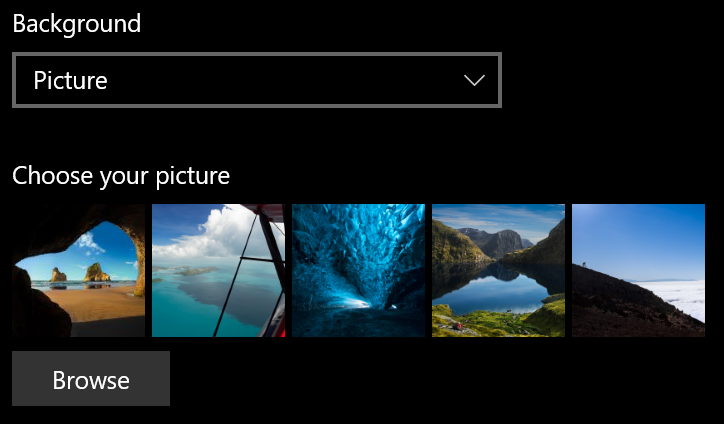
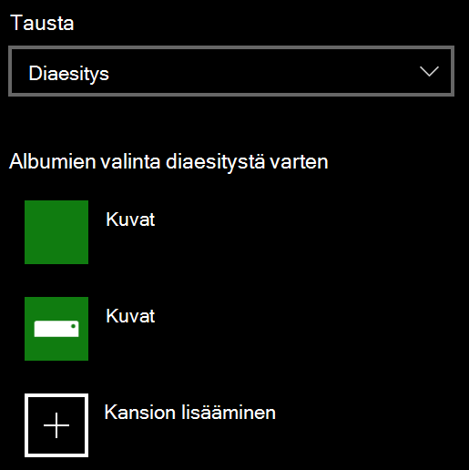

# Lukitusnäytön taustan muuttaminenChange your lock screen background

- Siirry Asetusten  >  **mukauttaminen**  >  **-lukitusnäyttöön.**Go to **Settings** > **Personalization** > **Lock screen**. Voit myös napsauttaa tai napauttaa [tätä](ms-settings:lockscreen?activationSource=GetHelp).Or click or tap [here](ms-settings:lockscreen?activationSource=GetHelp).

- Jos haluat määrittää mukautetun **taustakuvan,** valitse **kuva** avattavasta Tausta-luettelosta ja valitse sitten **Selaa** kuvaan.To set a custom background picture, select **Picture** from the **Background** drop-down list, and choose or **Browse** to the picture.

  

- Jos haluat määrittää mukautettujen kuvien diaesityksen, valitse **Diaesitys** avattavasta Tausta-luettelosta ja valitse albumi tai lisää kansio, joka sisältää diaesityksen kuvat. To set up a slideshow of custom pictures, select **Slideshow** from the **Background** drop-down list, and choose an album or add a folder that contains the pictures for the slideshow.

  
