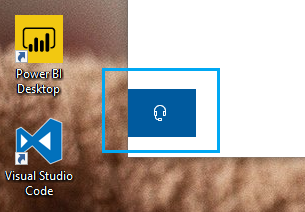

# Ota meihin yhteyttä napsauttamalla kuulokkeiden painiketta

Jos haluat ottaa yhteyttä Microsoft-tukeen, valitse **Ota yhteyttä** tämän sovelluksen vasemmassa alakulmassa. Pikaikkunan sisällä sinut ohjataan oikeaan tukikanavaan, kun olet valinnut tuote- ja ongelmaluokan.

Voit jatkaa sovelluksen muiden sovellusten kanssa vuorovaikutusta myös sen jälkeen, kun olet aloittanut Ota yhteyttä -istunnon. Ota meihin yhteyttä -paneeli voidaan tilapäisesti pienentää napsauttamalla mitä tahansa muuta sovelluksen kohtaa. Voit palata samaan istuntoon valitsemalla Ota **yhteyttä** uudelleen.
