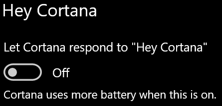

# Cortana ei puhu minulle tai kuule minua

Jos yrität käyttää Hei Cortana -ominaisuutta, jonka avulla voit keskustella Cortanan kanssa valitsematta Cortana-painiketta tehtäväpalkissa tai mikrofonipainiketta Cortana-paneelissa, varmista, että toiminto on otettu käyttöön:

1. Siirry **Käynnistä**-kohtaan ja valitse **[Asetukset > Cortana](ms-settings:cortana?activationSource=GetHelp)**.
2. Vaihda **Hei Cortana** -kohdan **Anna Cortanan vastata Hei Cortana -komentoon** arvoksi **Käytössä**.

**Estävätkö tietosuoja-asetukset Cortanaa kuulemasta sinua?**

Tietosuoja-asetukset voivat estää Cortanaa vastaamasta ääneesi.
- Tarkista, että online-puheentunnistus on otettu käyttöön:
    - Valitse **Käynnistä** ja sitten **[Asetukset > Tietosuoja > Puhe](ms-settings:privacy-speech?activationSource=GetHelp)**.
    - Vaihda **Online-puheentunnistus** -kohdan arvoksi **Käytössä**.
- Varmista, että Cortanalla on mikrofonin käyttöoikeus. 
    - Valitse Käynnistä ja sitten **[Asetukset > Tietosuoja > Mikrofoni](ms-settings:privacy-microphone?activationSource=GetHelp)**.
    - Etsi **Cortana** **Valitse, mitkä sovellukset saavat käyttää mikrofonia** -kohdan sovellusten ja palveluiden luettelosta ja varmista, että valinnan arvoksi on määritetty **Käytössä**.

Varmista lisäksi, että kaiutin tai mikrofoni on päällä ja toimii, jotta voit puhua Cortanalle.
