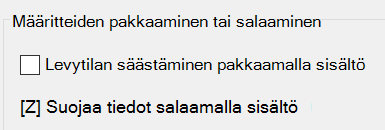

# Tiedostojen tai kansion salaaminen Windows 10:ssä

Voit salata koko levyn BitLockerin avulla, mutta jos haluat salata vain yksittäisiä tiedostoja tai kansioita (ja niiden sisällön):

1. Valitse **Resurssienhallinnassa** tiedosto(t) tai kansio(t), jotka haluat salata. Tässä esimerkissä on valittu kaksi tiedostoa:

    

2. Napsauta valittuja tiedostoja hiiren kakkospainikkeella ja valitse sitten **Ominaisuudet**.

3. Valitse **Ominaisuudet**-ikkunassa **Lisäasetukset**.

4. Valitse **Lisäominaisuudet**-ikkunassa **Suojaa tiedot salaamalla sisältö** -valintaruutu:

    

5. Napsauta **OK**.
