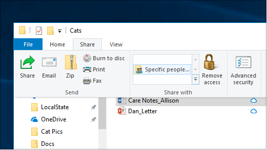
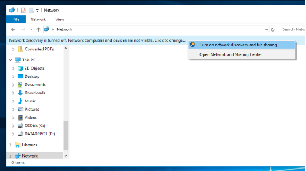

# Tiedostojen jakaminen verkon kautta Windows 10:ssä

**Huomautus:** Jos olet aiemmin käyttänyt kotiryhmää tiedostojen jakamiseen, huomaa, että kotiryhmä on poistettu Windows 10:stä (versio 1803). Voit nyt jakaa tulostimia ja tiedostoja Käyttämällä Windows 10:n sisäisiä ominaisuuksia.

**Tiedostojen tai kansioiden jakaminen verkon kautta**

- Valitse **Resurssienhallinnassa**tiedosto > valitse **Jaa-osan** > **jako** -välilehdestä **Tietyt henkilöt**.

    
          
- Jos valitset useita tiedostoja kerralla, voit jakaa ne kaikki samalla tavalla. Se tehdas ajaksi kansio, kanssa.

**Tiedostojen jakavien verkossa olevien laitteiden tarkasteleminen**

- Valitse **Resurssienhallinnassa** **Verkko**. Jos verkon etsiminen ei ole käytössä, näyttöön tulee virhesanoma "Verkon etsiminen on poistettu käytöstä..."

- Valitse **Verkon etsiminen on poistettu käytöstä** -banneri ja valitse sitten Ota verkon etsiminen ja tiedostojen **jakaminen käyttöön**.

    

[Lisätietoja tiedostojen jakamisesta verkon kautta](https://support.microsoft.com/help/4092694/windows-10-file-sharing-over-a-network)

[Tiedostojen jakaminen sovellusten, OneDriven, sähköpostien ja monessa esimerkissä](https://support.microsoft.com/help/4027674/windows-10-share-files-in-file-explorer)
