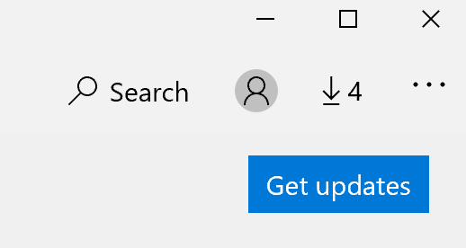

# Sovellusten näyttökielen asentaminen

Kun olet vaihtanut näyttökielen Windows 10, jotkin sovellukset saattavat edelleen käyttää edellistä kieltä, kun avaat ne. Näin tapahtuu, koska sovelluksen uudet versiot tälle kielelle on ladattava Kaupasta. Voit korjata ongelman joko odottamaan automaattista päivitystä tai asentamalla sovellusten päivitetyn version manuaalisesti.

Voit asentaa päivityksen manuaalisesti **avaamalla** Microsoft Store ja valitsemalla **Lataukset ja** päivitykset oikeassa yläkulmassa. Valitse sitten **Hae päivitykset**. Jos kieltä ei muuteta, kun päivitys on valmis, käynnistä tietokone uudelleen.

Lisätietoja syöttö- ja näyttökielen asetuksista on kohdassa [Syöttö- ja näyttökielen asetusten hallinta Windows 10.](https://support.microsoft.com/help/4027670/windows-10-add-and-switch-input-and-display-language-preferences)
