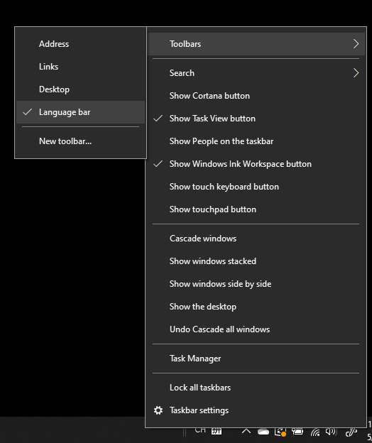

# Kielipalkin piilottaminen, näyttäminen tai palauttaminen

**Kielipalkin pienentäminen:**

Voit napsauttaa pienennä-painiketta kielipalkin oikeassa yläkulmassa. Voit myös vetää kielipalkin tehtäväpalkkiin, jolloin se pienentyy automaattisesti.

**Kielipalkin ponnahdusikkuna:**

Jos et halua kiinnittää kielipalkkia tehtäväpalkkiin, napsauta hiiren kakkospainikkeella mitä tahansa tyhjää  kohtaa tehtäväpalkissa ja poista valinta Kielipalkki-vaihtoehdosta Työkalurivit-valikossa. Kielipalkki tulee tällöin näkyviin tehtäväpalkin ulkopuolelle edellisen näyttökuvan mukaisesti.

**Kielipalkin palauttaminen oletuskieleksi:**

Napsauta työkalurivin kielipainiketta hiiren kakkospainikkeella ja valitse **valikossa** Palauta kielipalkkivaihtoehto. Tämä palauttaa oletusasetuksen.

