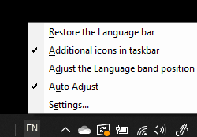

# Kielipalkin piilottaminen, näyttäminen tai palauttaminenHide, display, or reset the language bar

**Kielipalkin pienentäminen:****To minimize the language bar:**

Voit napsauttaa pienennä-painiketta kielipalkin oikeassa yläkulmassa.You can click the minimize button on the top right corner of the language bar. Voit myös vetää kielipalkin tehtäväpalkkiin, jolloin se pienentyy automaattisesti.Or, you can just drag the language bar to the task bar, which will automatically minimize it.

**Kielipalkin ponnahdusikkuna:****To pop out the language bar:**

Jos et halua kiinnittää kielipalkkia tehtäväpalkkiin, napsauta hiiren kakkospainikkeella mitä tahansa tyhjää  kohtaa tehtäväpalkissa ja poista valinta Kielipalkki-vaihtoehdosta Työkalurivit-valikossa.If you don't want to dock the language bar in the taskbar, right-click any empty space in the taskbar, and uncheck the **Language bar** option in the Toolbars menu. Kielipalkki tulee tällöin näkyviin tehtäväpalkin ulkopuolelle edellisen näyttökuvan mukaisesti.This will make the language bar appear outside the taskbar, just like the previous screenshot.

**Kielipalkin palauttaminen oletuskieleksi:****To restore the language bar to default:**

Napsauta työkalurivin kielipainiketta hiiren kakkospainikkeella ja valitse **valikossa** Palauta kielipalkkivaihtoehto.Right-click the language button in the toolbar, and click **Restore the language bar** option in the menu. Tämä palauttaa oletusasetuksen.This will restore it to default.

