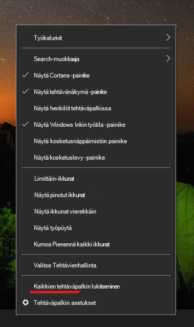

# Siirrä tehtäväpalkki työpöydän kumpaankin reunaan tai yläreunaanMove the taskbar to either side or the top of your desktop

Varmista ensin, että tehtäväpalkin lukitus on avattu.First, please confirm that the taskbar is unlocked. Voit selvittää, onko omasi lukitsematon, napsauttamalla tehtäväpalkin tyhjää tilaa  hiiren kakkospainikkeella ja tarkistamalla, onko Lukitse tehtäväpalkki -kohdan vieressä valintamerkki.To find out whether yours is unlocked, right-click any empty space on the taskbar and see whether **Lock the taskbar** has a checkmark next to it. Jos tehtäväpalkissa on valintamerkki, se on lukittu eikä sitä voi siirtää.If there is a checkmark, the taskbar is locked and cannot be moved. Kun valitset **Lukitse tehtäväpalkki** kerran, sen lukitus poistetaan ja valintamerkki poistetaan.Clicking **Lock the taskbar** once will unlock it and remove the checkmark.

Jos tehtäväpalkissa on useita näyttöjä, näet Lukitse kaikki **tehtäväpalkit -ruudut**.If you have multiple monitors that display the taskbar, you will see **Lock all taskbars**.

Kun tehtäväpalkin lukitus on avattu, voit painaa pitkään mitä tahansa tyhjää kohtaa tehtäväpalkissa ja vetää sen näyttöön haluamallasi sijainnilla.Once the taskbar is unlocked, you can press and hold any empty space on the taskbar and drag it to the location you want on the screen. Voit tehdä tämän myös napsauttamalla hiiren kakkospainikkeella mitä tahansa tyhjää kohtaa tehtäväpalkissa ja valitsemalla tehtäväpalkin > ** tehtäväpalkin sijainti näytössä.**You can also do so by right-clicking on any empty space on the taskbar and go to **[Taskbar settings](ms-settings:taskbar?activationSource=GetHelp) > Taskbar location on screen**.
