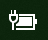

# Virta- tai akkukuvake puuttuu Windows 10:ssä

Jos Windows 10 -laitteessasi (kuten kannettavassa tietokoneessa, tabletissa tai UPS:ään USB:n avulla yhdistetyssä PC-tietokoneessa) on akku, tehtäväpalkissa lähellä kelloa näytetään tavallisesti virta- tai akkukuvake. Esimerkki:

Jos et näe tätä kuvaketta, se on voitu piilottaa:

1. Siirry kohtaan **[Asetukset > Mukauttaminen > Tehtäväpalkki](ms-settings:taskbar?activationSource=GetHelp)**.

2. Valitse ilmoitusalueella **Valitse, mitkä kuvakkeet näkyvät tehtäväpalkissa**.

3. Etsi luettelosta **Virta** ja muuta sen valinnaksi **Käytössä**.

    

**Vianmääritys**

Jos noudatit yllä olevia ohjeita eikä **Virta**-vaihtopainiketta näy tai se näkyy harmaana, kirjoita tehtäväpalkin hakuruutuun **laitehallinta** ja valitse sitten tulosluettelosta **Laitehallinta**. Napsauta **Akut**-kohdassa laitteesi akkua hiiren kakkospainikkeella. Valitse sitten **Poista käytöstä** ja **Kyllä**. Odota muutama sekunti, napsauta akkua hiiren kakkospainikkeella ja valitse **Ota käyttöön**. Käynnistä laite sitten uudelleen.

Jos noudatit yllä olevia ohjeita eikä akkukuvaketta näy tehtäväpalkissa, kirjoita tehtäväpalkin hakuruutuun **tehtävien hallinta** ja valitse sitten tulosluettelosta **Tehtävien hallinta**. Napsauta **Prosessit**-välilehden **Nimi**-kohdassa **Resurssienhallinta**-kohtaa hiiren kakkospainikkeella ja valitse sitten **Käynnistä uudelleen**.
