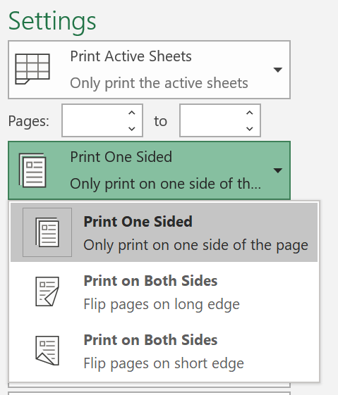

# Tulostaminen paperin molemmille puolille (kaksipuolinen tulostus)

**Pystyykö tulostimeni kaksipuolisen tulostuksen?**

Tulostimen ominaisuuksien yhteenvedon tai käyttöoppaan pitäisi kertoa, pystyykö tulostin tulostamaan paperin molemmille puolille eli kaksipuoliseen tulostukseen. Jos sinulla on Microsoft Office, voit selvittää asian myös avaamalla Office-sovelluksen, kuten Wordin tai Excelin, valitsemalla Tiedosto **> Tulosta**, varmistamalla, että oikea tulostin on valittuna, ja etsimällä ominaisuuden Asetukset-osiosta. Esimerkiksi: 

**Kaksipuolinen tulostus Microsoft Officessa**

Jos tulostin pystyy tulostamaan molemmille puolille ja siirryt Office-sovelluksessa Tiedosto **>** Tulosta -vaihtoehdon, näet vaihtoehdon Tulosta molemmille puolille, kuten edellä olevassa esimerkissä.  Valitse haluamasi kaksipuolisen tulostuksen tyyppi (käännä pitkän reunan ympäri  tai käännä lyhyen reunan ympäri) ja aloita tulostus valitsemalla Tulosta.

**Kaksipuolinen tulostus mistä tahansa sovelluksesta**

Useissa tulostetuissa sovelluksissa näkyy yleinen tulostusvalintaikkuna, joka näyttää tältä: 

Varmista, että oikea tulostin on valittuna, ja avaa **sitten** tulostimen asetusikkuna valitsemalla Asetukset. Jos tulostin pystyy kaksipuoliseen tulostukseen, mahdollisuus ottaa tämä käyttöön nykyisessä tulostustyössä näkyy tässä ikkunassa.
