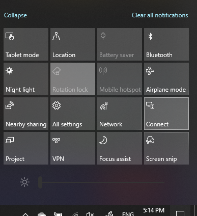

# Project PC-tieto koneeseenProject to a PC

Valitse kohde laitteessa (projisoidaan)-kohdassa projisoinnin asetukset-sivu, jotta **se avautuu tähän tieto koneeseen**.On your destination device (projecting to), search for "Projection Settings" to open the Settings page of **Projecting to this PC**. Varmista seuraavat asiat:Then make sure that:
- "Jotkin Windows-ja Android-laitteet voivat heijastaa tätä tieto konetta, kun se on OK"-pudotus valikosta on valittu **aina pois käytöstä**."Some Windows and Android devices can project to this PC when you say it's OK" drop-down menu is set to **Always Off**.
- "Kysy Projectiin tähän tieto koneeseen"-pudotus valikosta on valittu aina, **Kun yhteys on tarpeen**."Ask to project to this PC" drop-down menu is set to **Every time a connection is required**.
- "Edellytä PIN-koodi paria"-pudotus valikosta on valittu **ei koskaan**."Require PIN for pairing" drop-down menu is set to **Never**.

Käynnistä kohde laitteessa **Connect** -sovellus **käynnistämällä ja etsimällä** haku "Yhdistä".On your destination device, launch **Connect** app by going to **Start** and search for "Connect".

Valitse sitten lähde laitteessa, jota yrität Projectissa:Then, on your source device that you are trying to project from:

1. Avaa toiminto keskus painamalla **Windows-näppäintä ja A** .Press **Windows key + A** to open Action Center.
2. Valitse **Yhdistä**.Click **Connect**.
3. Valitse laite, jonka haluat heijastaa näyttöä.Click the device you want to project the screen to.

Edellä kuvattujen vaiheiden jälkeen kohde laitteen pitäisi näyttää lähde laitteen näyttö, jos se on toissijainen näyttö laite.After the above steps, your destination device should display the screen of the source device as if it is a secondary monitor.
