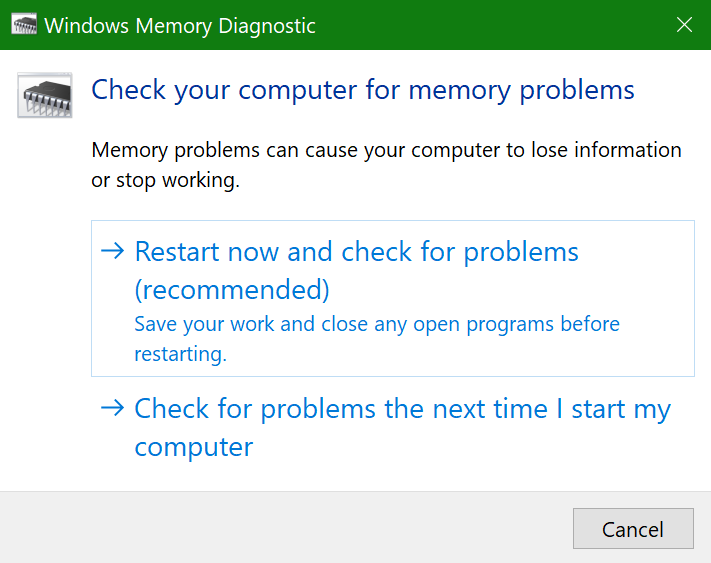

# Windowsin muistin diagnostiikan käyttö Windows 10:ssäRun Windows Memory Diagnostics in Windows 10

Jos tietokoneesi Windows ja sovellukset kaatavat, jäädyvät tai toimivat epävakaalla tavalla, tietokoneen muistissa (RAM-muistissa) voi olla ongelma.If Windows and apps on your PC are crashing, freezing, or acting in an unstable manner, you may have a problem with the PC’s memory (RAM). Voit tarkistaa tietokoneen RAM-muistiongelmat Windowsin muistin diagnostiikan avulla.You can run the Windows Memory Diagnostic to check for problems with the PC’s RAM.

Kirjoita tehtäväpalkin hakuruutuun muistin **vianmääritys** ja valitse sitten **Windowsin muistin vianmääritys**.In the search box on your taskbar, type **memory diagnostic**, and then select **Windows Memory Diagnostic**. 

Jotta voit suorittaa vianmäärityksen, tietokone on käynnistettävä uudelleen.To run the diagnostic, the PC needs to restart. Voit käynnistää vianmäärityksen heti uudelleen (tallenna työsi ja sulje ensin avoimet asiakirjat ja sähköpostiviestit) tai ajoita vianmääritys toimimaan automaattisesti, kun tietokone seuraavan kerran käynnistyy uudelleen:You have the option to restart immediately (please save your work and close open documents and e-mails first), or schedule the diagnostic to run automatically the next time the PC restarts:

Kun tietokone käynnistyy uudelleen, **Windowsin muistin diagnostiikkatyökalu** toimii automaattisesti.When the PC restarts, the **Windows Memory Diagnostics Tool** will run automatically. Tila ja edistyminen näytetään diagnostiikan suorittamisen aikana, ja voit peruuttaa diagnostiikan  painamalla ESC-näppäintä.Status and progress will be displayed as the diagnostics run, and you have the option of cancelling the diagnostics by hitting the **ESC** key on your keyboard.

Kun diagnostiikka on valmis, Windows käynnistyy normaalisti.When the diagnostics are complete, Windows will start normally.
Heti uudelleenkäynnistyksen jälkeen näyttöön tulee työpöytä-ilmoitus (tehtäväpalkin Toimintokeskus-kuvakkeen vieressä) sen merkiksi, löytyikö muistivirheitä. Immediately after restart, when the Desktop appears, a notification will appear (next to the **Action Center** icon on the taskbar), to indicate whether any memory errors were found. Esimerkkejä:For example:

Tässä on Toimintokeskus-kuvake:Here's the Action Center icon:  

Esimerkkiilmoitus:And a sample notification: 

Jos et saanut ilmoitusta, voit  tuoda toimintokeskuksen näkyviin ja  tarkastella vieritettävää ilmoitusluetteloa valitsemalla tehtäväpalkista Toimintokeskus-kuvakkeen.If you missed the notification, you can select the **Action Center** icon  on the taskbar to display the **Action Center** and see a scrollable list of notifications.

Voit tarkastella yksityiskohtaisia tietoja **kirjoittamalla tapahtuman** tehtäväpalkin hakuruutuun ja valitsemalla sitten **Tapahtumienvalvonta**.To review detailed information, type **event** into the search box on your taskbar, and then select **Event Viewer**. Siirry **Tapahtumienvalvonnan** vasemmanpuoleisessa ruudussa kohtaan **Windows-lokit > järjestelmä**.In the **Event Viewer**’s left-hand pane, navigate to **Windows Logs > System**. Etsi oikeanpuoleisessa ruudussa luetteloa samalla,  kun tarkastelet Lähde-saraketta, kunnes näet Tapahtumat, joiden arvo on **Lähdearvo MemoryDiagnostics-Results.**In the right-hand pane, scan down the list while looking at the **Source** column, until you see events with Source value **MemoryDiagnostics-Results**. Korosta kukin tapahtuma ja katso tulostiedot luettelon alapuolella olevassa **Yleiset-välilehden** ruudussa.Highlight each such event and see the result information in the box under the **General** tab below the list.
