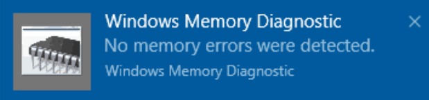

# Suorita Windows vianmääritys Windows 10

Jos Windows ja tietokoneesi sovellukset kaatuvat, jäädyvät tai toimivat epävakaalla tavalla, ongelma saattaa olla tietokoneen muistissa (RAM). Voit tarkistaa tietokoneen RAM Windows ongelmat suoritat muistiongelman vianmäärityksen avulla.

Kirjoita tehtäväpalkin hakuruutuun muistin **vianmääritys** ja valitse sitten Windows **muistidiagnostiikka**. 

Jotta voit suorittaa vianmäärityksen, tietokone on käynnistettävä uudelleen. Voit käynnistää vianmäärityksen heti uudelleen (tallenna työsi ja sulje ensin avoimet asiakirjat ja sähköpostiviestit) tai ajoita vianmääritys toimimaan automaattisesti, kun tietokone seuraavan kerran käynnistyy uudelleen:

Kun tietokone käynnistyy uudelleen, **Windows muistidiagnostiikkatyökalu** toimii automaattisesti. Tila ja edistyminen näytetään diagnostiikan suorittamisen aikana, ja voit peruuttaa diagnostiikan  painamalla ESC-näppäintä.

Kun diagnostiikka on valmis, Windows käynnistyy normaalisti.
Heti uudelleenkäynnistyksen jälkeen näyttöön tulee työpöytä-ilmoitus (tehtäväpalkin Toimintokeskus-kuvakkeen vieressä) sen merkiksi, löytyikö muistivirheitä.  Esimerkiksi:

Tässä on Toimintokeskus-kuvake:  

Esimerkkiilmoitus: 

Jos et saanut ilmoitusta, voit  tuoda toimintokeskuksen näkyviin ja  tarkastella vieritettävää ilmoitusluetteloa valitsemalla tehtäväpalkista Toimintokeskus-kuvakkeen.

Voit tarkastella yksityiskohtaisia tietoja **kirjoittamalla tapahtuman** tehtäväpalkin hakuruutuun ja valitsemalla sitten **Tapahtumienvalvonta**. Siirry **Tapahtumienvalvonnan** vasemmanpuoleisessa ruudussa kohtaan Windows **lokit > järjestelmä.** Etsi oikeanpuoleisessa ruudussa luetteloa samalla,  kun tarkastelet Lähde-saraketta, kunnes näet Tapahtumat, joiden arvo on **Lähdearvo MemoryDiagnostics-Results.** Korosta kukin tapahtuma ja katso tulostiedot luettelon alapuolella olevassa **Yleiset-välilehden** ruudussa.
