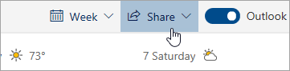

# Jakaminen Outlookin verkkoversiossaSharing with Outlook on the web

1. Siirry kalenteriin valitsemalla sivun alareunasta Kalenteri.At the bottom of the page, select Calendar to go to Calendar.

2. Valitse Kalenterin sivun yläreunassa olevasta työkalurivistä **Jaa**ja valitse jaettava kalenteri.In Calendar, on the toolbar at the top of the page, select **Share**, and choose the calendar you want to share. 

    

    **Huomautus:** Et voi jakaa muiden omistamia kalentereita.**Note**: You can't share calendars owned by other people.

3. Kirjoita sen henkilön nimi tai sähköpostiosoite, jonka kanssa haluat jakaa kalenterisi.Enter the name or email address of the person you want to share your calendar with.

4. Valitse, miten haluat henkilön käyttävän kalenteriasi:Choose how you want the person to use your calendar: 
    - **Voi tarkastella, kun olen kiireinen**   antaa heidän nähdä, milloin olet kiireinen, mutta ei sisällä tietoja, kuten tapahtuman sijaintia.**Can view when I'm busy** lets them see when you're busy but doesn't include details like the event location. 
    - **Otsikoiden ja sijaintien**   tarkasteleminen antaa heidän nähdä, milloin olet kiireinen, sekä tapahtumien otsikon ja sijainnin.**Can view titles and locations** lets them see when you're busy, as well as the title and location of events. 
    - **Voi tarkastella kaikkia tietoja**   antaa heidän nähdä kaikki tapahtumasi yksityiskohdat.**Can view all details** lets them see all the details of your events. 
    - **Voi muokata**   avulla he voivat muokata kalenteriasi.**Can edit** lets them edit your calendar. 
    - **Delegoi**   avulla he voivat muokata kalenteriasi ja jakaa sen muiden kanssa.**Delegate** lets them edit your calendar and share it with others.

5. Valitse **Jaa**.Select **Share**. Jos päätät olla jakamatta kalenteriasi juuri nyt, valitse **Poista**.If you decide not to share your calendar right now, select **Remove**. 

**Huomautuksia**:**Notes**:  

- Kun jaat kalenterisi sellaisen henkilön kanssa, joka ei käytä Outlookin verkkokäyttöä, esimerkiksi Gmailia käyttävän henkilön kanssa, hän voi hyväksyä kutsun vain Microsoft 365-tilillä tai Outlook.com-tilillä.When sharing your calendar with someone who's not using Outlook on the web, for example, someone using Gmail, they'll only be able to accept the invitation using a Microsoft 365 or an Outlook.com account. 

- Internet-yhteyden jakava kalenteri on vain luku -muotoinen, joten vaikka myönnät muokkausoikeudet muille henkilöille, he eivät voi muokata kalenteriasi.ICS calendars are read-only, so even if you grant edit access to other people, they won't be able to edit your calendar. 

- Internet-yhteyden jakamisen kalenterin synkronointien määrä riippuu sen henkilön sähköpostipalveluntarjoajasta, jonka kanssa olet jakanut sen.How often your ICS calendar syncs depends on the email provider of the person you've shared it with. 

- Kalenterikohteet, jotka on merkitty yksityisiksi, on suojattu.Calendar items marked private are protected. Useimmat ihmiset, joiden kanssa jaat kalenterisi, näkevät vain yksityisiksi merkittyjen kohteiden kellonajan, eivät otsikon, sijainnin tai muita tietoja.Most people you share your calendar with see only the time of items marked private, not the title, location, or other details. Yksityisiksi merkityissä toistuvissa sarjoissa näkyy myös toistumiskaava.Recurring series marked as private will also show the recurrence pattern.
