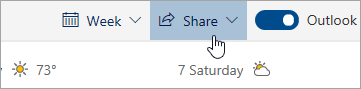

# Jakaminen Outlookin verkkoversiossaSharing with Outlook on the web

Valitse kalenterin sivun yläreunan työkaluriviltä **Jaa**ja valitse kalenteri, jonka haluat jakaa.From your Calendar, on the toolbar at the top of the page, select **Share**, and choose the calendar you want to share.

    

**Huomautus**: Et voi jakaa muiden omistamia kalentereita.**Note**: You can't share calendars owned by other people.

- Kirjoita sen henkilön nimi tai sähköpostiosoite, jonka kanssa haluat jakaa kalenterisi.Enter the name or email address of the person you want to share your calendar with.
- Valitse, miten haluat henkilön käyttävän kalenteriasi:Choose how you want the person to use your calendar:
    - **Voi tarkastella, kun olen kiireinen**   antaa heidän nähdä, milloin olet kiireinen, mutta ei sisällä tietoja, kuten tapahtuman sijaintia.**Can view when I'm busy** lets them see when you're busy but doesn't include details like the event location.
    - **Voi tarkastella otsikoita ja sijainteja**   antaa heidän nähdä, milloin olet kiireinen, sekä tapahtumien otsikko ja sijainti.**Can view titles and locations** lets them see when you're busy, as well as the title and location of events.
    - **Voi tarkastella kaikkia yksityiskohtia**   antaa heidän nähdä kaikki tapahtumasi tiedot.**Can view all details** lets them see all the details of your events.
    - **Voi muokata**   avulla he voivat muokata kalenteriasi.**Can edit** lets them edit your calendar.
    - **Edustaja**   avulla he voivat muokata kalenteriasi ja jakaa sen muiden kanssa.**Delegate** lets them edit your calendar and share it with others.
- Valitse **Jaa**.Select **Share**.
