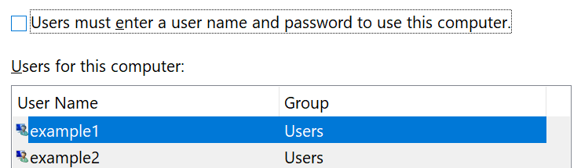

# Kirjautuminen Windows 10:een ilman salasanaaSign-in to Windows 10 without using a password

Jotta sinun ei tarvitsisi kirjoittaa salasanaa Windowsin käynnistyksen yhteydessä, suosittelemme, että käytät jotakin Windows Hello -suojatun kirjautumisvaihtoehdon, kuten PIN-koodin, kasvojentunnistuksen tai sormenjäljen, jos se on käytettävissä.To avoid having to type a password at Windows startup, we recommend you use one of the Windows Hello secure sign-in options, like a PIN, face recognition, or fingerprint, if available. Jos haluat todella poistaa suojatun kirjautumisen käytöstä, katso alla olevat "Kirjaudu automaattisesti Windows 10:een" -ohjeet.If you really want to disable secure sign-in, see the "Automatically sign in to Windows 10" instructions below.

**Suojaa Windows Hello vaihtoehtoja tilin salasana****Secure Windows Hello alternatives to the account password**

Siirry **kohtaan Asetukset > Tilit > kirjautumisasetukset** (tai klikkaa [tästä](ms-settings:signinoptions?activationSource=GetHelp)).Go to **Settings  > Accounts > Sign-in options** (or click [here](ms-settings:signinoptions?activationSource=GetHelp)). Käytettävissä olevat kirjautumisvaihtoehdot näkyvät luettelossa.Available sign-in options will be listed. Esimerkki:For example:

Määritä se napsauttamalla tai napauttamalla jotakin vaihtoehtoa.Click or tap one of the options to configure it. Kun seuraavan kerran käynnistät Windowsin tai avaat sen lukituksen, voit käyttää uutta vaihtoehtoa salasanan sijaan.Next time you start or unlock Windows, you will be able to use the new option instead of a password. 

**Kirjautuminen automaattisesti Windows 10:een****Automatically sign-in to Windows 10**

**Huomautus:** Automaattinen sisäänkirjautuminen on kätevää, mutta siinä on tietoturvariski, varsinkin jos useat henkilöt ovat käytettävissä tietokoneessasi.**Note**: Automatic sign-in is convenient, but introduces a security risk, especially if your PC is accessible by multiple people. 

1. Napsauta tai napauta **tehtäväpalkin** Käynnistä-painiketta.Click or tap the **Start** button in the Taskbar.

2. Kirjake **netplwiz** ja humauttaa Astua avain jotta auki Käyttäjä Selittää asian akkuna.Type **netplwiz** and hit the Enter key to open the User Accounts window.

3. Valitse **Käyttäjätilit**-kohdassa tili, johon haluat kirjautua automaattisesti, kun Windows käynnistyy.In **User Accounts**, click the account you want to automatically sign in to when Windows starts.

4. Poista "Käyttäjien on annettava käyttäjänimi ja salasana käyttää tätä tietokonetta" -valintaruudun valinta.Uncheck the "Users must enter a user name and password to use this computer" checkbox.

    

5. Valitse **OK**.Click **OK**. Sinua pyydetään antamaan ja vahvistamaan valitsemasi tilin salasana.You will be asked to enter and confirm the password for the account you selected. Lopeta valitsemalla **OK.**Click **OK** to finish. Kun Windows 10 käynnistyy seuraavan kerran, se kirjautuu automaattisesti valitsemaasi tiliin.Next time Windows 10 starts, it will automatically sign in to the account you selected.
