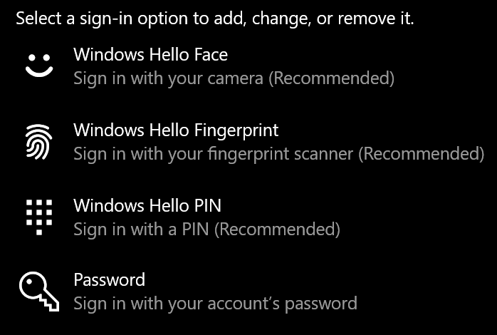

# Kirjautuminen Windows 10: een ilman Sala sanaaSign-in to Windows 10 without using a password

Jos haluat välttyä kirjoittamasta Sala sanaa Windowsin käynnistyessä, suosittelemme, että käytät jotakin Windows Hello-kirjautumisvaihtoehtoa, kuten PIN-koodi, kasvojentunnistus tai sormen jälki, jos se on käytettävissä.To avoid having to type a password at Windows startup, we recommend you use one of the Windows Hello secure sign-in options, like a PIN, face recognition, or fingerprint, if available. Jos haluat todella poistaa suojatun kirjautumisen käytöstä, Lue ohjeet kohdasta "Kirjautuminen Windows 10: een automaattisesti".If you really want to disable secure sign-in, see the "Automatically sign in to Windows 10" instructions below.

**Secure Windows Hello-vaihto ehdot tilin Sala sanaksi****Secure Windows Hello alternatives to the account password**

Siirry kohtaan **asetukset > asiakkaat > kirjautumisvaihtoehdot** (tai napsauta [tätä](ms-settings:signinoptions?activationSource=GetHelp)).Go to **Settings  > Accounts > Sign-in options** (or click [here](ms-settings:signinoptions?activationSource=GetHelp)). Käytettävissä olevat kirjautumisvaihtoehdot näkyvät luettelossa.Available sign-in options will be listed. Esimerkiksi:For example:

Voit määrittää sen napsauttamalla tai napauttamalla jotakin vaihto ehtoa.Click or tap one of the options to configure it. Kun seuraavan kerran käynnistät tai avaat Windowsin, voit käyttää uutta vaihto ehtoa Sala sanan sijaan.Next time you start or unlock Windows, you will be able to use the new option instead of a password. 

**Kirjautuminen automaattisesti Windows 10: een****Automatically sign-in to Windows 10**

**Huomautus**: Automaattinen sisäänkirjautuminen on kätevää, mutta se sisältää tieto turva riskin etenkin, jos tieto koneesi on usean henkilön käytettävissä.**Note**: Automatic sign-in is convenient, but introduces a security risk, especially if your PC is accessible by multiple people. 

1. Napsauta tai napauta tehtävä palkin **Käynnistä** -painiketta.Click or tap the **Start** button in the Taskbar.

2. Kirjoita **netplwiz** ja avaa käyttäjä tunnukset-ikkuna painamalla ENTER-näppäintä.Type **netplwiz** and hit the Enter key to open the User Accounts window.

3. Valitse **käyttäjä tilit**-kohdassa tili, johon haluat kirja utua automaattisesti, kun Windows käynnistyy.In **User Accounts**, click the account you want to automatically sign in to when Windows starts.

4. Poista "käyttäjien on annettava käyttäjä nimi ja sala sana, jotta voit käyttää tätä tieto konetta"-valinta neliötä.Uncheck the "Users must enter a user name and password to use this computer" checkbox.

    

5. Valitse **OK**.Click **OK**. Sinua pyydetään antamaan ja vahvistamaan valitsemasi tilin sala sana.You will be asked to enter and confirm the password for the account you selected. Valitse **OK** , jos haluat viimeistellä.Click **OK** to finish. Kun Windows 10 käynnistetään seuraavan kerran, se kirjautuu automaattisesti valitsemaasi tiliin.Next time Windows 10 starts, it will automatically sign in to the account you selected.
