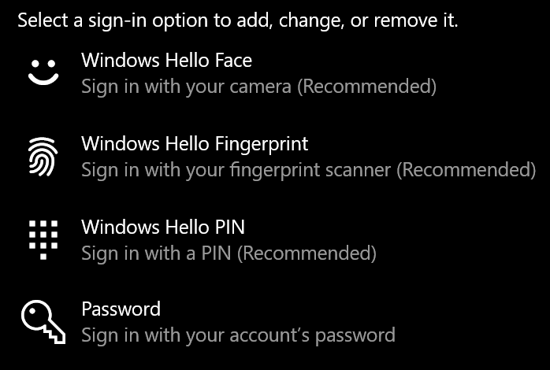
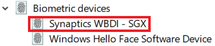

# Sormenjälkilukituksen käyttö Windows 10:ssäUse fingerprint unlock option in Windows 10

**Windows Hellon sormenjäljen ottaminen käyttöön****Enable Windows Hello Fingerprint**

Jotta voit poistaa Windows 10:n lukituksen sormenjäljen avulla, sinun on määritettävä Windows Hello Fingerprint lisäämällä (antamalla Windowsin opetella tunnistamaan) vähintään yksi sormi.To unlock Windows 10 using your fingerprint, you need to set up Windows Hello Fingerprint by adding (letting Windows learn to recognize) at least one finger. 

1. Siirry asetukset **> tilit > kirjautumisasetukset** (tai napsauta [tätä).](ms-settings:signinoptions?activationSource=GetHelp)Go to **Settings  > Accounts > Sign-in options** (or click [here](ms-settings:signinoptions?activationSource=GetHelp)). Käytettävissä olevat kirjautumisvaihtoehdot tulevat luetteloon.Available sign-in options will be listed. Esimerkiksi:For example:

    

2. Napsauta tai napauta **Windows Hellon sormenjälkeä** ja **valitse sitten Määritä**.Click or tap **Windows Hello Fingerprint**, then click **Set up**. Valitse Windows Hellon määritysikkunassa **Aloita käyttö.**In the Windows Hello setup window, click **Get started**. Sormenjälkitunnistin aktivoituu, ja sinua pyydetään asetamaan sormesi tunnistimeen:The fingerprint sensor will activate, and you'll be asked to place your finger on the sensor:

   

3. Noudata ohjeita, jotka pyytävät sinua skannaamaan sormella toistuvasti.Follow the instructions, which will ask you to repeatedly scan your finger. Kun tämä on valmis, voit lisätä muita sormia, joita haluat ehkä käyttää kirjautumiseen.When this is finished, you'll have the option of adding other fingers you may want to use for sign-in. Kun seuraavan kerran kirjaudut Windows 10:ssä, voit käyttää sormenjälkeäsi.Next time you sign in to Windows 10, you will have the option of using your fingerprint to do so.

**Windows Hellon sormenjälki ei ole käytettävissä kirjautumisvaihtoehtona****Windows Hello Fingerprint not available as a sign-in option**

Jos Windows Hello Fingerprint ei näy kirjautumisasetusten vaihtoehtona, Windows ei ole tietoinen tietokoneeseen liitetystä sormenjälkilukijasta tai että järjestelmäkäytäntö estää sen käytön (jos esimerkiksi työpaikkasi hallinnoi tietokonetta).If Windows Hello Fingerprint is not shown as an option in **Sign-in options**, it means Windows is not aware of any fingerprint reader/scanner attached to your PC, or that a system policy prevents its use (if for example your PC is managed by your workplace). Vianmääritys:To troubleshoot: 

1. Valitse **tehtäväpalkin** Käynnistä-painike ja etsi **Laitehallinta.**Select the **Start** button in the Taskbar and search for **Device Manager**.

2. Avaa Laitehallinta **napsauttamalla tai napauttamalla**.Click or tap to open **Device Manager**.

3. Laajenna Laitehallinnassa Biometriset laitteet napsauttamalla sen chevron-kohtaa.In Device Manager, expand Biometric devices by clicking its chevron.

   

4. Sormenjälkiskannerilla pitäisi olla biometrinen laite, kuten Synaptics WBDI -skanneri:Your fingerprint scanner should be listed as a biometric device, such as the Synaptics WBDI scanner:

   

5. Jos sormenjälkilukija ei ole näkyvissä ja skanneri on integroitu tietokoneeseen, siirry tietokoneen valmistajan sivustoon.If your fingerprint scanner is not shown, and the scanner is integrated into your PC, go to the PC manufacturer's website. Etsi PC-mallin teknisestä tuesta Windows 10 -ohjainta, jonka voit asentaa.In the technical support section for your PC model, search for a Windows 10 driver for a scanner that you can install.

6. Jos skanneri on erillinen tietokoneesta (USB:n kautta liitettynä), etsi ja asenna Windows 10 :n laiteohjainohjelmisto skannerimallia varten skannerivalmistajan sivustosta.If the scanner is separate from the PC (attached via USB), go to the scanner manufacturer's website to find and install Windows 10 device driver software for the scanner model you have.
