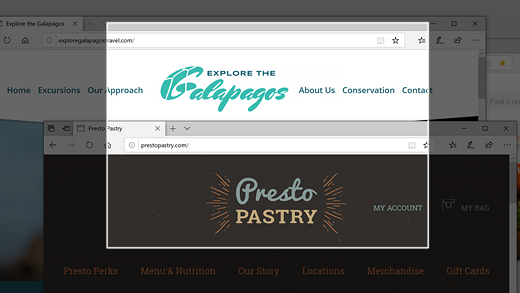
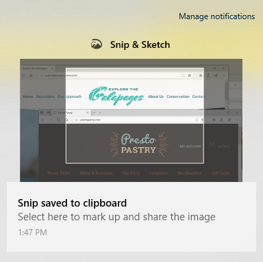

# Sieppaa, & ja jaa kuvia Leike-luonnoksen avulla

Näyttöluonnoksen nimi on nyt **Leike & luonnostelusta.** **Voit ottaa leikeen nopeasti:**

1. Paina **näppäinyhdistelmää Windows-näppäin + Vaihto + S.** Näyttö tummenee ja kohdistin näkyy ristinä. 

2. Valitse kopioitaessa olevan alueen reunasta kohta ja napsauta kohdistinta hiiren kakkospainikkeella. 

3. Korosta kohdistimen avulla alue, jonka haluat tallentaa. Näyttökuvasi alue tulee näkyviin näyttöön.

   

Kopioitu kuva tallennetaan leikepöydälle, ja se on valmis liittämistä varten sähköpostiviestiin tai tiedostoon. 

**Jos haluat muokata kuvaa tai tarkastella sitä:** 

- Napsauta tehtäväpalkin oikeassa reunassa olevaa ilmoituskuvaketta. ja napsauta juuri kaappaamaani kuvaa. Leike avautuu Luonnoslehtiö-& leikesovelluksessa.

   
