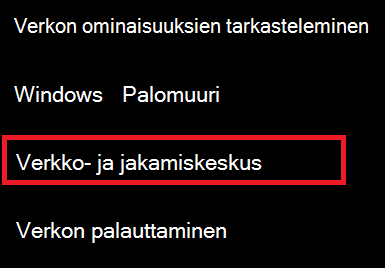
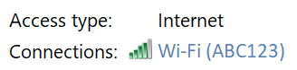
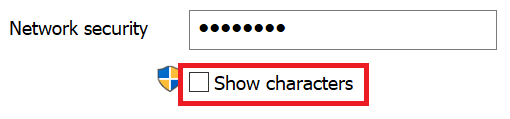

# Wi-Fi-verkon salasanan tarkasteleminen Windows 10:ssäView Wi-Fi network password in Windows 10

1. Varmista, että Windows 10 -tietokone on yhdistetty Wi-Fi-verkkoon.Make sure your Windows 10 PC is connected to the Wi-Fi network.

2. Siirry **asetukset > Verkko & Internet > Tila**, tai klikkaa tai napauta [tätä](ms-settings:network?activationSource=GetHelp) antaa meidät sinne nyt.)Go to **Settings  > Network & Internet  > Status**, or click or tap [here](ms-settings:network?activationSource=GetHelp) to let us take you there now.)

3. Valitse **Verkko- ja jakamiskeskus**.Click **Network and Sharing Center**.

    

4. **Verkko- ja jakamiskeskuksessa** **Yhteydet**-kohdan vieressä näkyy langattoman verkon nimi.In **Network and Sharing Center**, next to **Connections**, you will see the name of your wireless network. Jos verkon nimi on esimerkiksi ABC123, saatat nähdä:For example, if your network is named "ABC123," you might see:

    

    Avaa Wi-Fi-tila -ikkuna napsauttamalla langattoman verkon nimeä.Click the wireless network name to open the Wi-Fi Status window. 

5. Valitse Wi-Fi-tila -ikkunassa **Langattomat ominaisuudet**, valitse **Suojaus-välilehti** ja valitse **Näytä merkit**.In the Wi-Fi Status window, click **Wireless Properties**, click the **Security** tab, and check **Show characters**.

    

